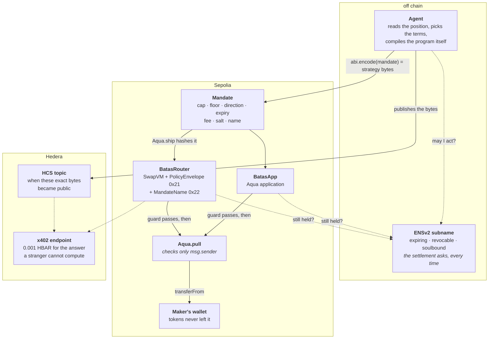
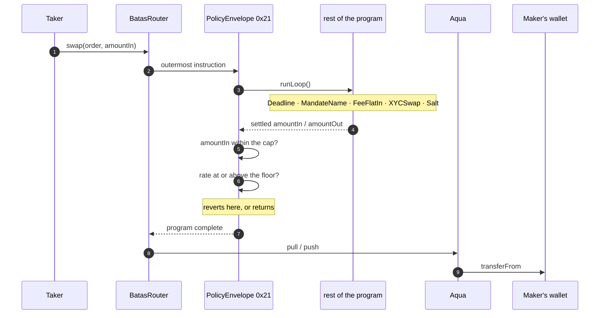

# Batas

*Batas* — Indonesian for **mandate**: authority entrusted within limits that must not be exceeded.

An autonomous agent can run your liquidity position. It cannot exceed the terms you granted it,
because the only contract allowed to touch your tokens refuses to settle a swap that breaks them.

---

## In sixty seconds

A maker grants an agent a **cap, a floor and an expiry**. Those three terms are `abi.encode`d and
handed to `Aqua.ship()` as the strategy bytes, so the mandate hash *is* the strategy hash — the
terms are the position's identity, not a label on it. Two contracts then refuse to settle a swap
that breaks them, and both refuse before any token moves.



| What stops the agent | Where it is enforced | What it costs to check |
|---|---|---|
| trade larger than the cap | `PolicyEnvelope` inside the VM, and `BatasApp` before `pull()` | nothing — it reverts |
| price under the floor | same two surfaces, on the settled registers | nothing |
| a mandate past its expiry | `Deadline` in the program, and `BatasApp` | nothing |
| the maker changing their mind | the ENSv2 name the *settlement* consults (`MandateName`, slot `0x22`), or `Aqua.dock()` | one transaction |
| *"was this grant ever public?"* | Hedera Consensus Service, read from a public mirror node | nothing, and it does not route through us |

## See it work

```bash
npm run walkthrough              # free: everything anyone can verify without us
npm run walkthrough -- --paid    # and then settle 0.001 HBAR for the rest
```

Five steps that read public chains and a public mirror node, then one that pays. The split is the
argument: the limits are arithmetic on bytes anyone holds, so they cost nothing and route through
nothing of ours. What the payment buys is one answer assembled across three networks — the terms,
the consensus timestamp on which those exact bytes became public, and the identity behind the
position with a check that it is held by the address that granted the mandate.

## The problem

1inch's [Aqua](https://github.com/1inch/aqua) is a shared liquidity layer where a maker never
deposits anything. Tokens stay in their wallet; Aqua keeps a ledger of allowances and pulls
directly from the wallet at settlement time. That design removes custody risk — and concentrates
a different one.

`Aqua.pull()` checks nothing beyond `msg.sender`:

```solidity
// Aqua.sol
function pull(address maker, bytes32 strategyHash, address token, uint256 amount, address to) external {
    Balance storage balance = _balances[maker][msg.sender][strategyHash][token];
    ...
    IERC20(token).safeTransferFrom(maker, to, amount);
}
```

Whichever app the maker shipped to may pull their tokens. The entire security model is one
sentence: **you trust the app you ship to.** Hand that app to an autonomous agent and the
question becomes sharp — what stops it, and where is the stop enforced?

Most agent tooling answers "in the application layer", which means nowhere: anyone can call the
contract directly and skip your checks.

## The answer

A **mandate** — a size cap, a floor price, and an expiry — enforced in the two places that
actually gate the money.

How long the grant lasts is the maker's to choose, through `BATAS_MANDATE_HOURS` — the demo script
and the agent read the same variable, so the two cannot disagree about a term. The default is two
hours. The deployed demo runs on thirty days so the position stays live long enough to be looked
at; an agent that picked its own term would be choosing the one limit it is least entitled to.

### 1. The mandate *is* the Aqua strategy

`Aqua.ship()` hashes the strategy bytes you hand it. Batas passes the encoded mandate as those
bytes, so the mandate hash and the strategy hash are the same value. The terms are not metadata
attached to the position; they are its identity. Aqua refuses to re-ship a hash it has already
seen, so the terms cannot be quietly rewritten afterwards.

`Shipped` also carries the full mandate in its event data, so the grant is publicly auditable
without storing a byte of it.

### 2. The limits are checked before tokens move

[`BatasApp`](src/BatasApp.sol) is a constant-product Aqua application. Every swap validates the
mandate *before* `AQUA.pull()`, because after `pull()` the tokens have already left.

### 3. And again inside the VM

[`PolicyEnvelope`](src/PolicyEnvelope.sol) is a new SwapVM instruction, built the way SwapVM's own
fee instructions are: it delegates the rest of the program to `runLoop()` and inspects the settled
registers when that returns. Placed first, it becomes the outermost frame of the program.



Read the order once and the design falls out: every transfer in `SwapVM.swap` happens *after*
`runLoop()` has returned, and `PolicyEnvelope` runs its checks inside that call. The guard is not
merely early in the program — it is before settlement itself, on both surfaces.

Two properties follow that a plain sequential guard cannot offer:

- **Placement stops mattering.** In `exactOut` mode `amountIn` is only final once the swap curve
  has run, so a sequential guard has to sit after the curve — a rule a program author can silently
  get wrong.
- **Nothing can undo the check.** Later instructions execute *inside* the wrapper. A fee appended
  behind the curve cannot push the amounts back out of bounds once the guard has already passed.

And it is close to free. `test_TheGuardCostsAlmostNothing` settles the same trade twice over
identical reserves, once with the envelope wrapped around the program and once without it, and the
difference is **933 gas** — about 0.8% of a settlement. Both positions are warmed first, because
the first version of that test read the guard as costing 14,590, which was mostly the price of
being the first swap against a fresh position rather than the price of the guard. A policy nobody
can afford to enforce is a policy nobody enforces, so the number is measured rather than asserted
to be small.

`test_FeeBehindTheGuardStillCounted` pins exactly this. `FeeFlatIn` sits after the envelope in
program order, yet it executes inside it: at 0.3% the rate lands near 1.974 and passes a 1.9 floor,
while at 5% the same mandate refuses the trade. A guard that merely ran first would have passed
before the fee ever touched the amounts.

### 4. And the maker can end it, on chain

The three terms bound what a settlement may do. `MandateName`, at opcode slot `0x22`, bounds
*whether there is one at all*: it asks an ENSv2 registry whether a name is still held by the
address the mandate names, and reverts the swap if it is not.

This closes a gap this document described before it filled. An ENSv2 subname expressed the agent's
authority from the first day — expiring, revocable, soulbound — and the agent consulted it before
acting. Nothing on chain did. So revoking the name stopped *this* agent, because this agent asks,
and stopped nobody else: not a second copy of it with the check removed, and not an ordinary taker
arriving at a position that was still shipped. The name was a control over the operator, and the
maker's only controls over the money were the expiry and `Aqua.dock()`.

Now the settlement itself asks. `agent/killswitch.mjs --prove` demonstrates it against the live
position, with two Sepolia transactions and three `eth_call`s that cost nothing:

```
$ node agent/killswitch.mjs --prove

kill switch  registry 0x945800bd6cdd60521b64a12d7b3f12fc90916a6b
             holder   0x39d2bae5eaeda9283535ddc98f1991c81ed5cd7e
             name     "agent"

quote 1 A, name held      -> 1952840679837944719 B

revoking "agent" …
quote 1 A, name revoked   -> refused: MandateNameNotHeld — the name is not held by the address the mandate names

re-granting "agent" …
quote 1 A, name restored  -> 1952840679837944719 B

the name gates the settlement, not merely the agent.
```

The caller making those quotes has never heard of ENS and would happily trade. That is the point:
the maker gets a kill switch that costs one transaction and needs no cooperation from the thing it
stops.

Four details are load-bearing, and three of them are lessons this project had already paid for once.

**Ownership is checked before expiry, and the order is the whole point.** `unregister` does not
zero a name's expiry — it sets it to the moment of revocation — so a name the owner pulled and one
that ran out are indistinguishable by timestamp. The first version checked the expiry first and
reported every revocation as `MandateNameLapsed`, which is the same wrong answer this project
already fixed off chain: the operator of a stopped agent told it had run out of time when its
authority had in fact been taken away. Burning clears the owner and lapsing does not, so asking who
holds it first separates them.

**The token id comes from the registry, never from the label.** It is the labelhash with its low 32
bits cleared, and those hold a version counter the registry bumps on re-registration. Deriving it
would ask about a token that does not exist — and the zero address that comes back reads as
*revoked* rather than as a wrong question. It is also why the re-grant in that transcript works at
all: the name has a new id afterwards, and `findTokenId` finds it.

**The argument length is checked.** `InstructionArgs` performs no bounds validation, so a truncated
`MandateName` reads its registry address out of whatever follows it in calldata. A misparsed fee
produces a wrong price and somebody notices; a guard pointed at a contract that is not a registry
is a guard that passes.

**The expiry rule is strictly greater than, and deliberately not the rule the mandate's own
deadline uses.** SwapVM's `Deadline` is `block.timestamp <= deadline`, so a mandate is live through
its final second; a name is expired *at* its expiry, and `classifyName` off chain says so too. Each
surface matches the system it mirrors rather than matching the other one.

Naming no registry is a real choice rather than a default. Such a mandate is still a coherent grant
— it ends at its expiry, and the maker can still dock the position — and it is one fewer external
call on the settlement path. `explain()` reports which kind you are looking at as a fact rather
than as a warning.

## What already exists, and what does not

This is a crowded problem and an empty position. Both halves are worth stating plainly.

**The problem is not speculative.** The **Asset-Enforced Spend Mandate**
draft, posted to Ethereum Magicians in June 2026 with participation from the ERC-8226 authors and
MetaMask's delegation team, proposes token-level guardrails for agent wallets: a `spendGate` on the
transfer path, `checkTransfer` returning reason codes like `EXPIRED` and `OVER_TX_CAP`. It reaches
for the same word and nearly the same error taxonomy as this repository.

It also shows where the ceiling of that approach is. A gate on the transfer path sees one leg. It
can bound **how much leaves** and nothing else, because a token contract has no idea what comes
back. `minRateE18` is not expressible there. Enforcement inside the settlement venue sees both
legs, which is why Batas can bound the price a position accepts rather than only its size.

[`docs/spend-mandate-reply.md`](docs/spend-mandate-reply.md) is that argument written out for the
thread, with the measurement behind it and two places where the draft's layer is clearly the better
one. It is drafted rather than posted: it goes out under a person's name, so that is their call.
[`UPSTREAM.md`](UPSTREAM.md) holds two findings on the same terms — one for swap-vm about what
changes when an instruction's job is to refuse rather than to price, and one for Foundry about
`forge build` and `forge test` writing different bytecode for the same contract.

**Enforcement elsewhere is advisory.** [ENShell](https://ethglobal.com/showcase/enshell-6t95y)
(ETHGlobal Cannes 2026, top ten) routes agent intents through Chainlink CRE to an LLM that scores
them 0–100,000 and answers approve/escalate/block. Wallet infrastructure — Turnkey, Openfort —
places policy at the account layer. All of it runs before a signature and off-chain, which means a
counterparty has to trust the operator's server, and a judgement made from a prompt can be argued
with. `PolicyEnvelope` runs during settlement, has no prompt, and reverts.

**1inch has a wrapping rate guard of its own, and this document used to say otherwise.** An
earlier version of this paragraph claimed nobody had written a policy instruction for SwapVM. That
was wrong: `RequireMinRate` in the vendor tree (`instructions/MinRate.sol`) delegates to `runLoop`
and refuses when the settled rate is worse than a floor — the floor half of `PolicyEnvelope`, in
the 0xb0 rates bank. It is not in `AquaOpcodes`, so it was never reachable on the Aqua router
without the same redeployment this project makes, and it carries no size cap, no direction, no
kill switch and no length check on its own arguments. What is new here is the rest: a per-trade cap
and a direction in the same frame, an app-surface twin compiled from one struct so the two cannot
drift, a name the settlement obeys, and a guard that refuses to read its limits out of the
instruction that follows it. The two Aqua winners went deep into the VM in other directions:
[Aqua0](https://ethglobal.com/showcase/aqua0-u2krx) (Buenos Aires 2025, 1inch 4th, since incubated
by 1inch) built new AMM curves as AquaApps across chains, and
[KSwap-VM](https://ethglobal.com/showcase/kswap-vm-aix5n) (Lisbon 2026, 1inch 3rd) wrote
K-framework semantics and proofs for the *existing* swap-vm instructions, filing real bug reports
against them. Market structure and verification.

**Naming an agent is not the novel part, and this repo does not claim it is.**
[HumanENS](https://ethglobal.com/showcase/humanens-9qp31) issues per-agent subnames behind World ID,
[AgentRadar](https://ethglobal.com/showcase/agentradar-4dx17) resolves ERC-8004 agents through a
wildcard CCIP-Read resolver and ranks them, and Uniforum gave debating Uniswap agents subdomain
identities. Batas uses ENSv2 for something those do not: the subname is not a label but the
**revocation lever**. The holder is granted `0x1100000` and nothing more, `UNREGISTER` and `RENEW`
stay with the grantor, and withholding `ROLE_CAN_TRANSFER_ADMIN` makes the grant soulbound. Read
[The name is a kill switch, not a label](#the-name-is-a-kill-switch-not-a-label) for the bitmap.

**And the paid endpoint sells a different good than its neighbours.** Hedera's x402 bounty closed in
July 2026 with five winners; the two published ones — Pinout and Mystic — meter a resource by the
second. `/v1/mandate/explain` meters nothing. It sells a verdict that the party asking for it cannot
produce alone: what a program's bytes actually permit, and whether the identity claiming to operate
it holds the registration it names.

## Where to look

| What | File |
|---|---|
| Mandate terms, and why the hash is the strategy hash | [`src/Mandate.sol`](src/Mandate.sol) |
| Aqua application; limits checked before `pull()` | [`src/BatasApp.sol`](src/BatasApp.sol) |
| Wrapping SwapVM instruction, opcode slot `0x21` | [`src/PolicyEnvelope.sol`](src/PolicyEnvelope.sol) |
| The kill switch as an instruction, slot `0x22` | [`src/MandateName.sol`](src/MandateName.sol) |
| Router carrying the extended instruction set | [`src/BatasRouter.sol`](src/BatasRouter.sol) |
| Aqua-layer tests | [`test/BatasApp.t.sol`](test/BatasApp.t.sol) |
| VM-layer tests | [`test/PolicyEnvelope.t.sol`](test/PolicyEnvelope.t.sol) |

Nothing in `node_modules/@1inch/**` is edited. `BatasOpcodes` claims two of the `_Ix` slots
`OpcodeList.sol` reserves per family bank for third parties — `_21` and `_22`, in the 0x20-0x3f
conditions and access guards bank, beside `Deadline` and the taker gates, which is the right bank
for both: one bounds what a settlement may do, the other bounds who may still cause one. The router is a redeployment, which
the 1inch track permits.

Two things about which base class to extend, both learned the hard way (the sizes below are from the first deployment; the router carrying both instructions is 21,178 bytes):

> **`AquaOpcodes`, not `Opcodes`.** The full set carries 24 instructions an Aqua strategy never
> reaches for, including every balance instruction, because in Aqua mode balances come from Aqua
> rather than from bytecode. Carrying them puts the router at 28,618 bytes against EIP-170's
> 24,576 and it cannot be deployed at all. On `AquaOpcodes` it is 20,623.
>
> **Not `OpcodesDebug` either.** That layer overrides `_runOpcode` without re-declaring it
> `virtual`, so it is terminal — you can have custom opcodes *or* debug opcodes, not both.

## Running it

```bash
npm install
npm test          # contracts, decoder, and the paid API surface
```

Four suites, run separately if you prefer:

| Suite | Command | What it covers |
|---|---|---|
| Contracts | `npm run test:sol` | Both enforcement surfaces, plus 2000 fuzz runs on their agreement |
| JavaScript | `npm run test:js` | The decoder, strategy recovery, and encoder parity with Solidity |
| Paid API | `npm run test:api` | Playwright against a local x402 endpoint, including what its 402 promises |
| Deployment | `npm run test:prod` | The same assertions against the URL the on-chain identity advertises |

The deployment suite runs daily in CI, and on a button, rather than on push: a push is what
causes the deploy, so the two race and the suite would report the deployment behind a commit it
has not been given time to become. Both times production actually fell behind, it was caught by
somebody remembering to run this by hand.

The API suite starts the service itself and asserts the payment requirement without spending
anything, so it runs anywhere. Settling a real payment needs Hedera credentials; that path is
exercised by `agent/inspect.mjs`.

### A cap that could never bind

The agent picked a floor 2% under spot and a cap of 10% of the reserve, as two independent
choices. They contradict: moving 10% of a constant product reserve walks the price about 9%, far
through a 2% floor. **The maximum trade the mandate advertised was one its own floor would refuse**
— a limit that reads like a limit and can never bind, which is worse than having none.

They are not independent choices at all. Solving the constant product for the largest input that
still clears the floor, after the fee, gives

```
amountIn ≤ reserveA · (slippage − fee) / ((1 − slippage)(1 − fee))
```

which at a 2% budget and a 0.3% fee is about **1.74% of the reserve**, not 10%. The cap is derived
from the floor now, and `capBps` only ever tightens it further.

The closed form is exact over the rationals and lands a hair under the floor once every step
rounds toward the maker, so the result is checked against the same arithmetic the contracts use
rather than trusted. Stepping down by wei does not converge — shrinking the input shrinks the
output in step, so both sides of the inequality move together — which is why the haircut is
relative. A position too small for the arithmetic to price gets a cap of zero, because a mandate
that permits nothing is safe and one that names an unreachable maximum is not.

### Two encoders, one format

The agent builds SwapVM programs in JavaScript; the contracts build them in Solidity through
`MandateLib.toProgram`. A program is just bytes, so nothing on chain would object to the two
drifting apart — which is exactly what had happened. **The agent was silently omitting the
`Deadline` instruction, so every mandate it granted was authority with no end**, while the project
described expiry as one of three terms.

`script/DumpPrograms.s.sol` now prints what Solidity emits for a fixed set of mandates, and
`agent/encoder-parity.test.mjs` runs it and asserts the JavaScript encoder produces the same bytes
case by case. Both sides now compile from one place, and one test asserts every compiled mandate
carries an expiry at all.

### A bug the fuzzer found

`testFuzz_SurfacesAgreeOnArbitraryTerms` failed at 1 wei of input. A 0.3% fee rounds up to the
entire input, leaving the curve nothing to price, so the output is zero. The VM refused the trade
through the order's `allowZeroAmountIn` trait; `BatasApp` accepted it, and the taker would have
paid a wei for nothing.

That is exactly the failure the agreement tests exist to catch — not one surface being wrong on its
own, but the two of them meaning different things. `BatasApp` now refuses zero output too.

### And one the tests could not run until it was fixed

`agent/inspect.mjs` recovered a program from Aqua's stored strategy by counting ABI words by hand.
`abi.encode(Order)` opens with an offset word because `Order` has a dynamic member, and the
hand-rolled version skipped it — surfacing as `Cannot convert 0x to a BigInt` from deep inside a
decoder, which sends you looking in the wrong place entirely. It uses viem's
`decodeAbiParameters` now, because the layout is already known by something that is not us.

Writing the test for it exposed a second problem: the file called `main()` at module scope, so
importing it ran the whole paid flow as a side effect of loading. `inspect.mjs`, `identity.mjs`
and `batas-agent.mjs` now only run when invoked directly.

### The fix that was never deployed

`BatasApp` on Sepolia was a version behind. `ZeroAmountOut` — the guard added after the fuzzer
found that a one-wei input has its whole value eaten by the rounded-up fee, leaving the taker
paying for nothing — existed in the source, in the tests and in this document, and not on chain.

Nothing looked wrong. The tests passed, the address held code, the explorer showed a verified
contract, and `verification/` offered a standard-json input to reproduce it. That input was a copy
of the source from before the fix, so it agreed with the deployment and disagreed with the
repository.

The first attempt to check this was wrong too. Searching the deployed bytecode for the error's
selector said "absent", which happened to be the right answer for the wrong reason — under
`via_ir` the optimizer does not leave selectors lying around as searchable constants, and the same
search on the freshly deployed contract also said "absent".

What settles it is comparing the whole runtime: metadata dropped, because it hashes the source
layout, and immutables blanked, because the artifact stores them as zeroes and the constructor
writes them. The old app came out 2,777 bytes against 2,797 in the source, first differing at byte
493.

`agent/deployed.test.mjs` does that comparison on every run, for both contracts, and checks that
the verification inputs still match the files they claim to be. A repository that says what is
deployed should be able to prove it.

It found one more thing immediately, and it was not what it looked like. The comparison passed
locally and failed in CI at byte 1,169, so the first guess was the toolchain — CI installed
`stable` while the deployment came from 1.8.0. Pinning it changed nothing. The lengths were the
clue: 20,596 bytes built against 20,538 on chain, with every jump destination after that point
shifted by the difference.

`forge build` and `forge test` do not compile `src/` the same way.

```
forge clean && forge build   →  BatasRouter runtime 20,538 bytes
forge clean && forge test    →  BatasRouter runtime 20,596 bytes
```

The deployed contract is the first, because that is what `forge create` produces. CI ran only
`forge test`, so it compared the chain against an artifact no deployment ever came from. **The
bytecode a Foundry project deploys is not the bytecode its tests exercise**, which is worth knowing
independently of this check — and which nothing here would have surfaced without it.

CI now runs `npm run build:contracts` first; `forge test` afterwards reuses the cache rather than
replacing it. `--force` because the cache decides rather than the command — whichever compiled
first wins, so a warm tree from a test run survives a plain `forge build`, which is how this bit me
a second time after I thought it was fixed. The toolchain stays pinned anyway, because everything
else already is.

### What coverage found that reading did not

`forge coverage` reported lines, statements and functions at 100% and **branches at 16%**. Foundry
mis-attributes branches under `via-ir`, so the number itself is not worth much; what it was worth
was checking which reverts any test actually asserted. Three had none.

`InsufficientOutputAmount` — the taker's own slippage bound, never exercised. `ZeroAmountOut` — the
guard added to fix a bug the fuzzer found, asserted nowhere by name, so removing it would have
shown up only as a disagreement between two surfaces rather than as a failure. And `swap` hands
control to `msg.sender` after the output has left and before payment is checked, the same shape as
a flash swap, with a `nonReentrantStrategy` lock that nothing had ever tried to break.

The lock holds. Re-entering a *different* position of the same maker is allowed — the key is
`(maker, strategyHash)` — and that is now pinned too, because a per-position lock is the kind of
narrowing that looks like an oversight until someone checks the accounting survives it.

### A guard that read its limits from its neighbours

`InstructionArgs.at` is a raw `calldataload`, and 1inch says so plainly: *"the library does not
implement out-of-bounds read validations"*. Arg length is the program author's problem. For a fee
or a curve that is a fair trade — a misparse produces a wrong price and somebody notices. For
`PolicyEnvelope` it produces a guard that passes.

An envelope declaring sixteen bytes of args instead of thirty-two read `minRateE18` out of the
instruction that followed it. Removing the new length check and running
`test_RevertWhenEnvelopeArgsAreTruncated` gives a floor of
`148889121703133190954033214317794426880` — a position that refuses everything. That direction is
an accident of the layout: the value comes from whatever bytes happen to sit after the envelope,
and an envelope that is the last instruction reads past `order.data` entirely. A guard whose
strictness depends on its neighbours is not a guard.

It also settled a disagreement. The decoder in `agent/swapvm.mjs` already refused a short envelope
rather than half-reading it, so until now the report and the chain described different programs.

`parse` checks the length. The router was redeployed and re-verified for it.

### The same bug, twice, on opposite sides of the fence

The JavaScript agent once built its program instruction by instruction and left `Deadline` out, so
every mandate it granted was permanent. That was fixed by giving both sides one encoder —
`MandateLib.toProgram` in Solidity, `toProgram` in `agent/swapvm.mjs` — and a parity test that
compiles the first and compares it to the second.

`script/Demo.s.sol` was still chaining instructions by hand. It shipped four of the five, and the
one it dropped was `Deadline` again. Nothing caught it: the parity test compares the two encoders
to each other and says nothing about who calls them, and the mandate on chain decoded perfectly —
`101` cap, `1.92` floor, `0.3%` fee — with an expiry field that was simply absent.

Two things changed. The demo builds a `Mandate` and calls `MandateLib.toProgram`, so there is no
longer a second place to get it wrong. And `explain()` now says so out loud:

```
notes
  - No deadline: this mandate never expires and can only be ended by revoking it.
```

That omission was the one gap in the report. A missing cap was called out, a missing floor was
called out, an expiry in the past was called out — and the most open-ended grant of the set went
unremarked, in the answer people pay for. The program that shipped without a deadline is kept in
`swapvm.test.mjs` as the fixture for that note, because it is the real shape of the failure rather
than a constructed one.

Every dependency is pinned to an exact commit or version. That is deliberate: 1inch replaced
`InstructionBuilder` with a `MemoryPtr` streaming API during this hackathon, and an unpinned
install would silently hand a judge a different API than these tests pass on.

`verification/` holds the standard-json compiler input for each contract, for anyone who wants to
reproduce the bytecode independently of the explorer.

### Live on Sepolia

Aqua is already deployed on Sepolia, so the liquidity layer is used as-is. Only our own contracts
went out.

All four are source-verified on Etherscan, so the code below can be read on the explorer rather
than taken from this repo on trust.

| Contract | Address |
|---|---|
| Aqua (canonical, not ours) | [`0x1111113CCf1426A8E30e2bfF5E005d929bF6a90a`](https://sepolia.etherscan.io/address/0x1111113CCf1426A8E30e2bfF5E005d929bF6a90a) |
| `BatasRouter` (SwapVM + PolicyEnvelope + MandateName) | [`0x648a0F330f432452CF53B967fd13305528C320a6`](https://sepolia.etherscan.io/address/0x648a0F330f432452CF53B967fd13305528C320a6) |
| `BatasApp` | [`0x2A06D6121Cedc9D67404bfb0Ec34BAB8d393e05e`](https://sepolia.etherscan.io/address/0x2A06D6121Cedc9D67404bfb0Ec34BAB8d393e05e) |
| Demo token A | [`0x3b8B1A25502C9f4C84e93A17dCc1720379cEa29B`](https://sepolia.etherscan.io/address/0x3b8B1A25502C9f4C84e93A17dCc1720379cEa29B) |
| Demo token B | [`0x6D3987Cbc99723fb7a13D4C6Ce54bA3Ab919fB81`](https://sepolia.etherscan.io/address/0x6D3987Cbc99723fb7a13D4C6Ce54bA3Ab919fB81) |
| ERC-8004 identity registry (canonical) | [`0x8004A818BFB912233c491871b3d84c89A494BD9e`](https://sepolia.etherscan.io/address/0x8004A818BFB912233c491871b3d84c89A494BD9e) |

### Live on Hedera testnet

| What | Where |
|---|---|
| Mandate publication topic | [`0.0.10394165`](https://hashscan.io/testnet/topic/0.0.10394165) |
| Inspection service, paid | [`0.0.10388560`](https://hashscan.io/testnet/account/0.0.10388560) |
| Agent, paying | [`0.0.10388401`](https://hashscan.io/testnet/account/0.0.10388401) |

The topic is readable by anyone, with no account and no key:
`https://testnet.mirrornode.hedera.com/api/v1/topics/0.0.10394165/messages`

```bash
cp .env.example .env    # then fill in SEPOLIA_PRIVATE_KEY
forge script script/Deploy.s.sol:Deploy --rpc-url $SEPOLIA_RPC_URL --broadcast
forge script script/Demo.s.sol:Demo     --rpc-url $SEPOLIA_RPC_URL --broadcast
node agent/batas-agent.mjs
```

The demo and the agent default to the addresses above, so they run against a live position with no
setup. To point them at your own deployment instead, set `BATAS_ROUTER`, `BATAS_TOKEN_A` and
`BATAS_TOKEN_B` in `.env` — nothing needs editing in the source.

The whole chain is exercised against a local fork before each release:

```bash
anvil --fork-url $SEPOLIA_RPC_URL &
forge script script/Deploy.s.sol:Deploy --rpc-url http://127.0.0.1:8545 --broadcast
BATAS_ROUTER=<deployed> BATAS_TOKEN_A=<deployed> BATAS_TOKEN_B=<deployed>   forge script script/Demo.s.sol:Demo --rpc-url http://127.0.0.1:8545 --broadcast
```

> If `forge script --broadcast` fails to decode constructor arguments, `out/` is holding artifacts
> from source files that no longer exist and forge is matching a deployment against the wrong
> bytecode. `forge clean` fixes it. This bit us after a rename, and the failure mode is nasty
> because the script still prints plausible addresses while broadcasting nothing at all.

### A settled mandate, on-chain

`script/Demo.s.sol` grants a mandate and trades inside it against live Aqua. Real ERC-20
transfers, no mocked settlement:

| Step | Transaction |
|---|---|
| Ship liquidity under the mandate | [`0x46d3822b…`](https://sepolia.etherscan.io/tx/0x46d3822bb6096432f02d1ac29aa07e737cc7f048d2ecc2e984792526ae3694b1) |
| Swap settled inside the mandate | [`0x6fe65721…`](https://sepolia.etherscan.io/tx/0x6fe6572134ae5a67248a08ec5bb193a0ef2be70e5a5f0d6ba155ae1e9106be40) |

10 tokenA in, **19.743160687941225977 tokenB** out to
[`0x8474d483…`](https://sepolia.etherscan.io/address/0x8474d483Cc4374B8a16fE2D019717b23f0a5BD83) —
constant product less the 0.3% fee, judged against the 1.9 floor and allowed through.

An oversized trade against the same live position reverts with
`MandateAmountInExceeded(101e18, 100e18)` before any token moves — in the same run, right after the
settled one, so a single command shows both the trade the mandate allows and the trade it refuses:

```
settled: in 10000000000000000000 out 19743160687941225977
recipient received 19743160687941225977 of tokenB

refused 101000000000000000000 in, over the mandate's cap of 100000000000000000000
  revert data:
  0xb9f1dc1d00000000000000000000000000000000000000000000000579a814e10a7400000000000000000000000000000000000000000000000000056bc75e2d63100000
```

`0xb9f1dc1d` is `MandateAmountInExceeded(uint256,uint256)`; the two words after it are the amount
asked for and the cap that refused it. The refusal is a read-only call outside the broadcast, so it
costs nothing and does not fail the script — reverting is the result being demonstrated.

> Both transactions predate the current `BatasApp`. The one in the table above was deployed after
> a fuzzer, handed the expiry to vary, found the two enforcement surfaces disagreeing on the expiry
> second itself — so a reader following these links lands on the address that came before it. The
> mandate they settled and the terms they prove are unchanged; only the second surface was
> corrected. `agent/deployed.test.mjs` is what makes that statement checkable rather than
> reassuring.

Each run salts the program, because Aqua permanently burns a strategy hash once it has been used.
`Salt` is the instruction that exists for exactly this: a no-op whose bytes change the program
hash, which is how the same terms get a fresh position.

## The agent

`agent/batas-agent.mjs` is the half the project is named for. It reads the live position on
Sepolia, decides what mandate to grant, encodes the SwapVM program itself, and ships it.

```bash
node agent/batas-agent.mjs          # observe and decide, no transaction
node agent/batas-agent.mjs --ship   # also grant the mandate it decided on
node agent/batas-agent.mjs --watch  # keep running it, rather than running once
```

`--watch` is what makes *an agent runs your position* true rather than aspirational. Until it
existed this was a command: it observed, decided, shipped and exited, and the word autonomous was
carrying a claim one invocation cannot support. A position is run over time — the mandate
approaches its deadline, the owner takes the name back and later hands it over again — and none of
that was anything the program could see.

```
watching every 300s; renewing inside 3600s of expiry
observing only; add --ship to let it act
...
renewal  706h left; nothing to do
```

It renews on **time and nothing else**. Not because the price moved — that is a decision rather
than an omission, since re-shipping burns a strategy hash and writes new terms, so an agent that
re-granted whenever spot drifted would be rewriting its own limits as a matter of routine, which is
the one thing this project exists to prevent it doing. `renewalDecision` is pure and pinned by
test, including that a live mandate carrying *no* deadline is replaced rather than read as "not due
yet".

**Renewing closes what it replaces**, and that is a gap the watch loop created rather than found.
Shipping a fresh position used to leave the previous one standing with its Aqua allowance intact,
so an agent left running for a week would accumulate live positions — each inside its own cap, and
none of them bounded by the others. The cap bounds a trade, the floor bounds a sequence, and
nothing bounded the number of sequences.

`Aqua.dock` keys on `msg.sender`, so only the maker can do it, and the agent does it immediately
after the new mandate is shipped — in that order, because a failure there should leave two live
positions rather than none. Docking is not emptying: `safeBalances` on a docked strategy *reverts*
rather than answering zero, so the replaced mandate stops being something anyone can trade against
at all.

Three guards, because a loop that sends transactions needs them: it ships only inside the renewal
window, never more than `--max-ships` times in one run, and the interval has a floor of 30 seconds
— an agent polling two chains every second is not attentive, it is a denial of service with good
intentions. A revoked name stops it acting without stopping the loop, because an agent that exited
on revocation would have to be restarted by the person who just demonstrated they can stop it
remotely.

A real run against the deployed position:

```
observed 1 mandate(s); reading the newest
reserves 1010 A / 1980.256839312058774023 B
spot     1.960650335952533439 B per A

decision
  budget 100bps from 1 settled trade(s) — not enough settled trades to measure; using the floor
  floor  1.941043832593008104 B per A  (1.00% under spot)
  cap    7.162902849964033514 A  (0.70% of reserve, the largest trade that still clears the floor)
  fee    0.3%
  expires in 719 hours

program  0x2121...056167656e747003007530500002080000000 (107 bytes)

encoding check
  local  0x4d113cd9c03a5ab7aebea6191fa903adf379e648c9c21911f956c09a24d9aeda
  chain  0x4d113cd9c03a5ab7aebea6191fa903adf379e648c9c21911f956c09a24d9aeda
  agree
```

Every number is read from the chain, including the slippage budget — which used to be 2% because
somebody typed 2%.

That number decides what the mandate refuses: too tight refuses every real trade, too loose
protects nothing. `volatilityBudget` reads the position's settled trades out of the router's
`Swapped` logs and takes the **widest gap between consecutive settlements**, clamped to 100-1000bps.

Be precise about what that measures, because the obvious reading is wrong. These are not
mid-prices: each rate is what a trade actually got, which already includes the slippage its own
size caused. What it measures is how far the price has moved between one settlement and the next
*at this position*, in practice, including the moving done by the trades themselves — which happens
to be exactly the quantity a floor has to survive. The widest gap rather than the average, because
a budget set to the typical move fails on the atypical one, and with a handful of samples there is
no percentile worth taking. A position with no history gets the 100bps floor, and the report says
which it got:

```
decision
  budget 108bps from 2 settled trade(s) - widest gap between settled trades was 108bps
  floor  1.935646207168143268 B per A  (1.08% under spot)
  cap    7.995884134408887803 A  (0.79% of reserve, the largest trade that still clears the floor)
```

The floor is one budget under the spot the reserves imply, and the cap is derived from the floor -
which is what actually bounds how far one trade can walk the price.

The **encoding check** is the part worth pausing on. The agent assembles the instruction stream
itself, byte by byte, then asks the deployed router to hash the resulting order. If a single
opcode, length prefix or trait bit were wrong, the two hashes would differ and it refuses to ship.
The chain agrees rather than being taken on trust.

Mandate granted by that run:
[`0x5226fd99…`](https://sepolia.etherscan.io/tx/0x5226fd991de5e122da66b5c6355c454add8dda1b537ad29adaff4d4bd2d97b0b).

And the point of the whole design: the agent picks these numbers, but it cannot widen them once
granted. `PolicyEnvelope` enforces whatever it proposed, inside the VM, for as long as the mandate
lives.

### Two things the chain taught the encoder

`MakerTraits` for an Aqua-backed order with no hooks is the Aqua flag at bit 254 plus four `uint16`
order-data offsets, all 40, because `data` opens with two addresses and nothing else. That was
decoded from a live order rather than assumed.

`Aqua.Shipped` declares **no indexed parameters at all** — maker, app, strategy hash and strategy
bytes all sit in the data, and the log carries a single topic. A node therefore cannot filter these
events by maker or app, so the agent fetches and sifts client-side. Worth knowing before building
any indexer on Aqua.

## The mandate as a name

A mandate is authority granted within limits, for a while, revocably, to one holder. ENSv2 has all
four as primitives rather than as conventions someone agrees to honour, so the grant is expressed
as a name rather than described by one.

```bash
node agent/ens.mjs --deploy         # deploy the mandate registry, once
node agent/ens.mjs --grant agent    # grant a subname whose expiry matches the live mandate
node agent/ens.mjs --read agent     # what it currently authorises
node agent/ens.mjs --revoke agent   # take it back early
```

The registry is a `UserRegistry` proxy deployed through ENS's own `VerifiableFactory`, at
[`0x945800Bd…`](https://sepolia.etherscan.io/address/0x945800Bd6CDd60521B64a12D7b3F12fC90916a6B).
Reading the granted name back off chain:

```
name          agent
expiry        2026-10-12T16:01:58.000Z
holder        0x1100000        SET_RESOLVER | SET_SUBREGISTRY
transferable  false
```

| Property of a mandate | ENSv2 primitive |
|---|---|
| Expiring | `expiry` is a parameter of `register()`, not a record anyone has to remember to check |
| Revocable | the grantor keeps `ROLE_UNREGISTER`; `unregister()` burns the token immediately |
| Non-transferable | `ROLE_CAN_TRANSFER_ADMIN` is withheld, so the name is soulbound to its holder |
| Scoped | the role bitmap names exactly what the holder may change, and nothing more |

**That expiry is not a coincidence.** It is read from the live position on chain and is the same
timestamp compiled into the program's `Deadline` instruction. The name and the authority it stands
for end at the same moment, because an identity that outlives the permission it represents is a
lie waiting to be believed.

### The name is a kill switch, not a label

The agent checks it before doing anything. Revoke the name and the agent stops, without touching
the position or spending anything on chain:

```
$ node agent/ens.mjs --revoke agent
revoked "agent"

$ node agent/batas-agent.mjs --ship
mandate name "agent": mandate name "agent" was revoked at 2026-09-06T22:18:24.000Z, ahead of its term
refusing to act without a valid mandate name

$ node agent/ens.mjs --grant agent      # and the agent resumes
mandate name "agent": held and unexpired
  43190 minutes of authority left
```

That check is what separates an integration from a mention: until the agent consulted the name,
"revocable" was a property the registry offered and nothing used.

> Running that cycle for real is what showed the report was wrong. `unregister` does not zero the
> expiry — it sets it to the moment of revocation — so a name the owner *pulled* and one that
> simply *ran out* both read as "expired", and the operator of a stopped agent was told the wrong
> reason. Worse, the branch meant to catch revocation was unreachable: it hung off a `try/catch`
> waiting for `ownerOf` to revert, and this registry answers a burned name with the zero address
> instead. Had the expiry check not shadowed it, the report would have been "held by 0x0000…",
> which is true and useless.
>
> Two signals separate them, and both cost nothing. `grant()` sets the name to expire with the
> mandate, so an expiry falling short of the mandate's own deadline means someone cut it short —
> and a name already burned while its term still runs is revoked outright. The judgement now lives
> in `classifyName`, apart from the chain reads, because logic that can only be exercised by
> sending a transaction does not get exercised.

> Making it load-bearing immediately exposed a bug. The registry's token id is the labelhash with
> its **low 32 bits cleared** — those hold a version counter it bumps on re-registration, so a
> stale approval cannot carry over to a name someone later re-registers. Passing a plain
> `keccak256(label)` asks about a token that does not exist, and the zero address that comes back
> reads as *revoked* rather than as a wrong question. The fix is to call the registry's own
> `findTokenId`; the re-grant above is visible in the token id ending `…561` where the first ended
> `…560`.

What the holder is refused matters as much as what it gets, and `agent/ens.test.mjs` pins each
one: no `ROLE_CAN_TRANSFER_ADMIN`, so the grant cannot be sold; no `ROLE_UNREGISTER`, so it cannot
erase the record of itself; no `ROLE_RENEW`, so it cannot extend its own authority; no
`ROLE_REGISTRAR`, so it cannot mint further names. Getting one of those shifts wrong is silent —
the registration still succeeds, the name simply permits more than intended.

> ENSv2 is in beta on Sepolia and the deployment moved once during this project: the registry
> contracts are a different size now than they were in August. Every address here was re-checked
> with `cast code` before use, and the role values came from the specification rather than from
> memory.

## A name other software can look up

The agent is registered in the canonical
[ERC-8004](https://eips.ethereum.org/EIPS/eip-8004) Identity Registry as **agent #10123** on
Sepolia — [`0x7754ce40…`](https://sepolia.etherscan.io/tx/0x7754ce40fe3f6e892512965e1c4c23b43c52d9643b532eb6cfaaecefa42165e2).

```bash
node agent/identity.mjs                       # build the registration, simulate, show the id it would mint
node agent/identity.mjs --register            # mint it
node agent/identity.mjs --read 10123
node agent/identity.mjs --update 10123        # show what has drifted
node agent/identity.mjs --update 10123 --write
```

ERC-8004 is an ERC-721 whose token URI resolves to a file describing what an agent is and where to
reach it. The registry sits at `0x8004A818BFB912233c491871b3d84c89A494BD9e` — the same address on
Ethereum Sepolia **and** Hedera testnet, which happen to be the two chains this project runs on.
Both were checked for code before anything was written to either.

The registration is a `data:` URI rather than a hosted link. A hosted file is a promise that some
server stays up, and the point of an identity registry is that the answer survives. Alongside it,
metadata entries keep the on-chain facts queryable without fetching the URI at all:

```
batas.chain        eip155:11155111
batas.router       0x648a0F330f432452CF53B967fd13305528C320a6
batas.app          0x2A06D6121Cedc9D67404bfb0Ec34BAB8d393e05e
batas.aqua         0x1111113CCf1426A8E30e2bfF5E005d929bF6a90a
batas.enforcement  swapvm-opcode:0x21,0x22
batas.x402.network hedera:testnet
batas.x402.payTo   0.0.10388560
batas.hcs.topic    0.0.10394165
batas.ens.registry 0x945800Bd6CDd60521B64a12D7b3F12fC90916a6B   the kill switch, discoverable from the identity
```

An earlier registration, agent #10120, named a source URL that turned out not to exist; #10123
replaces it. That is the cost of guessing at a fact instead of checking it.

Keeping it current is `--update`, not a second `--register`. Minting again would leave the first
identity standing and describing the same agent wrongly, with nothing to tell a reader which of the
two to believe. The update writes only what actually differs — it reads `getMetadata` for every key
first — so a run that changes nothing sends nothing.

Nothing is advertised that cannot be checked. No endpoint is listed that this repo does not serve,
because a registry full of dead links is worse than an empty one. The services list is what makes
the identity self-sufficient:

```
source     https://github.com/PugarHuda/batas
x402       https://batas-one.vercel.app/v1/mandate/explain
mandates   https://testnet.mirrornode.hedera.com/api/v1/topics/0.0.10394165/messages
```

The third one matters most. A reader who trusts neither this repository nor the paid endpoint can
still check any grant this agent made, on a mirror node that is public, unauthenticated, and not
ours. Identity leads to ledger; ledger holds the terms.

### And what anyone who traded here says about it

The identity registry answers *who is operating this position*. It cannot answer whether anyone has
traded against them and been treated well, and this project used one third of a standard whose
other two thirds are the part about trust.

ERC-8004's **reputation registry** is at
[`0x8004B663056A597D…`](https://sepolia.etherscan.io/address/0x8004B663056A597Dffe9eCcC1965A193B7388713),
and `getIdentityRegistry()` on it answers with the identity registry above — which is what actually
establishes the two are one deployment rather than two that happen to share a prefix. That check
was not ceremony: the addresses circulating for these include one beginning `0x8004B663056e9e57`,
which this document already warns about by name. The live one begins `0x8004B663056A597D`. Twelve
identical characters, then a different address.

```bash
npm run reputation 10123
node agent/counterparty.mjs --paranoid --trade    # trade, then say so on chain
```

The registry refuses feedback from the agent's own owner or operators:

```solidity
require(!isAuthorizedOrOwner(msg.sender, agentId), "Self-feedback not allowed");
```

which is the property that makes any of it worth reading, and the reason this only became possible
once the counterparty had a wallet of its own. A maker praising their own agent is not a reputation
system, and the contract says so.

What gets written is not a rating. A star count about an autonomous market maker means nothing and
can be checked by nobody. The counterparty records **how far above its advertised floor the trade
actually settled**, in basis points, with the Hedera publication record as the feedback URI: two
numbers both parties hold and a pointer to the evidence, so a reader redoes the arithmetic instead
of trusting it.

```
  traded        1 A in
  received      1.948987088535167759 B
  leaving feedback: 143bps above the floor, tagged floor-honoured
  feedback      success  0xc713d938…
  reputation    2 feedback from 1 client(s), 133bps above the floor on average
```

A trade settled exactly on the floor scores zero — the mandate was honoured and nothing was given
away beyond it — and a negative score is representable on purpose. The contracts refuse a breach,
so a negative reading is not a complaint about service; it is a claim that the enforcement failed,
and a registry that could only carry good news would be worth nothing.

The **validation registry** is deliberately absent. The canonical repository lists none for Sepolia
— it is "still under active update and discussion with the TEE community" — and naming an address
for it would be inventing a deployment.

> Two addresses circulate for these registries. The ones in most write-ups —
> `0x8004A169…` and `0x8004BAa1…` — hold code on **mainnet only** and are empty on Sepolia. The
> testnet deployments in the official `erc-8004/erc-8004-contracts` repository are the pair above.
> Both were verified with `cast code` before use.

## Paying for what the bytecode says

A Batas position states its terms only as SwapVM bytecode. Anyone about to trade against one — or
about to let an agent run under it — has to decode that stream to find out what it actually
enforces. `agent/service.mjs` does that decoding and sells it per call over
[x402](https://www.x402.org/) on Hedera, settled through the
[Blocky402](https://blocky402.com/) facilitator.

Live at **https://batas-one.vercel.app** — the same Express app that runs locally, served by
Vercel Functions, so there is one implementation rather than a hosted copy that can drift.

```bash
curl https://batas-one.vercel.app/                       # free: what it sells and what it costs
node agent/inspect.mjs 0x2120...                         # pay 0.001 HBAR and read the answer
BATAS_SERVICE_URL=http://localhost:4021 node agent/inspect.mjs 0x2120...   # against a local server
```

A serverless deployment answers its first request cold, and the facilitator handshake the paywall
needs runs on that request path, so the first caller after an idle period can see a 5xx where a
warm one sees the 402 immediately. `inspect.mjs` retries once. No payment is created for a failed
request, so the retry costs a second and nothing else.

A real settlement, confirmed on the Hedera mirror node:

```
result       SUCCESS
0.0.10388401  -0.001 HBAR     agent, paying
0.0.10388560  +0.001 HBAR     service, paid
0.0.7162784   -0.0024552      Blocky402 covering the network fee
```

No API key, no account, no subscription. The first request returns `402`, the client settles and
retries, and the payment is the authentication.

Decoded from the program the agent actually shipped, on a run of 2026-09-13 — the countdown in
the last line is why this is dated:

```
guarded by PolicyEnvelope: true
  @ 0 POLICY_ENVELOPE
  @35 DEADLINE
  @42 MANDATE_NAME
  @90 FEE_FLAT_IN
  @95 XYC_SWAP
  @97 SALT
enforced mandate
  max input   7.162902849964033514
  floor rate  1.941043832593008104
  direction   aToB
  fee         0.3%
  curve       constant product (x*y=k)
  expires     2026-10-12T16:01:58.000Z
  kill switch "agent" in 0x945800bd6cdd60521b64a12d7b3f12fc90916a6b
              held by 0x39d2bae5eaeda9283535ddc98f1991c81ed5cd7e
publication
  published   2026-09-12T17:02:25.719Z  (HCS consensus, topic 0.0.10394165 #10)
  granted by  0x39d2bae5eaeda9283535ddc98f1991c81ed5cd7e
  verify      https://testnet.mirrornode.hedera.com/api/v1/topics/0.0.10394165/messages/10
operator
  agent #10123  Batas
  held by     0x39D2bae5EAedA9283535dDC98F1991c81eD5Cd7E
  vouches     yes — the identity is held by the address that granted the mandate
notes
  - The floor is a fixed rate chosen when this mandate was granted, not a reading of any
    market, and the mandate has 29 days left — past the 7 days this report treats as short.
    It bounds how far trading can walk this position's own price. If the market moves under
    it, trades that empty the position at a rate the maker would no longer accept still
    satisfy the mandate.
```

`guarded` is the field worth reading first. It is true only when `PolicyEnvelope` occupies the
outermost position; anywhere else, later instructions can undo whatever it checked, and the service
says so in plain words rather than leaving the caller to notice.

### The part the caller could not have worked out alone

Decoding is arithmetic. A caller with the bytes and an afternoon could do it themselves, which
makes it a thin thing to charge for. The other two fields are not.

**`publication`** answers *when these bytes became public*, from
[Hedera Consensus Service](https://docs.hedera.com/hedera/sdks-and-apis/sdks/consensus-service).
The mandate already exists on Sepolia — Aqua puts the whole strategy in its `Shipped` event — but
that timestamp belongs to a block, and a counterparty checking it has to trust whichever RPC served
them. HCS is an ordering service and nothing else: a message gets a consensus timestamp the network
agrees on and a sequence number that cannot be reordered afterwards. `agent/hcs.mjs` submits the
program at grant time; the service matches on the bytes in the request, so no extra input is
needed. A program that decodes perfectly and has no record is a set of terms someone handed you a
minute ago, which is a different thing from a grant that has been standing.

The match is on the whole program, never a prefix or a hash. A mandate differing by one byte is a
different grant, and a loose match would let one publication vouch for all of them.

Reading it costs nothing and needs no account:

```bash
curl 'https://testnet.mirrornode.hedera.com/api/v1/topics/0.0.10394165/messages'
node agent/hcs.mjs --lookup 0x2120...      # or ask the same question locally
node agent/hcs.mjs --revocations agent     # and every time that name was taken back
```

**Withdrawals are published too, and that is not decoration.** A ledger carrying only grants tells
the optimistic half of the story: it says when authority was given and never when it was taken
back, so a reader arriving after a revocation sees a mandate that still looks to be standing. The
chain has the truth either way — the name is burned and the settlement refuses — but the record
that needs no account should not be the half that flatters us. `node agent/ens.mjs --revoke agent`
writes the note itself:

```
"agent" on topic 0.0.10394165: 4 revocation(s)
  #7  2026-09-11T02:55:10.617Z  registry 0x945800bd6cdd60521b64a12d7b3f12fc90916a6b
     https://testnet.mirrornode.hedera.com/api/v1/topics/0.0.10394165/messages/7
```

It is best effort on purpose. By the time that write is attempted the name is already revoked and
the authority already gone, so a failure to publish must not leave the operator thinking otherwise
— it says what it could not do and moves on.

A revocation names the *name*, not the program, because one name may gate more than one position,
and a topic is public and writable by anyone holding its submit key. `parseRevocationMessage` and
`parseMandateMessage` each refuse the other's records, which is pinned by a test: a revocation
counted as a grant would say authority was given at the moment it was taken away.

That is the property worth the trouble. The record is useful to a stranger *because* it does not
route through us.

**`operator`** answers *who is running this*, from the ERC-8004 registry, and `vouches` is the
field that matters: an identity held by someone other than the address that granted the mandate is
not evidence of anything, and the service says whose it actually is.

### Two things worth knowing before building this

The official Hedera x402 proof of concept points its **testnet** configuration at `x402.org` and
reaches for Blocky402 only on mainnet. The Hedera track requires Blocky402. It does serve
`hedera:testnet` — at `api.testnet.blocky402.com`, whose `/supported` sits at the root rather than
under the `/v1` path the site advertises. Copy the PoC as-is and you settle through the wrong
facilitator with everything appearing to work.

Payment is priced in **HBAR rather than USDC**. An HTS token has to be associated with an account
before it can be received; HBAR does not. That is one less step between a caller and an answer,
which is the entire point of paying per request. The client also caps itself at 0.01 HBAR per call
through x402 spend controls — the same idea the contracts enforce, one layer up.

## The other agent

Everything above is the maker's side: an agent that runs a position under terms it cannot exceed.
`agent/counterparty.mjs` is the other one — a different agent, with its own money and its own rules,
arriving at a position it did not create and deciding whether to trade against it.

It exists because *sold per call over x402* is a claim about a transaction between two machines, and
until now only one of those machines was in this repository. A CLI a person runs to buy an answer
demonstrates the payment. It does not demonstrate the **decision**, and the decision is the part
worth showing.

```bash
npm run counterparty                 # decide about the live position
node agent/counterparty.mjs --program 0x…    # decide about a program you were handed
node agent/counterparty.mjs --paranoid       # insist on knowing the operator, and pay for it
```

Nothing about the service is hard-coded into it. The endpoint, the price and the network come from
the host's own `/.well-known/x402` manifest, the way an indexer or a stranger's agent would find
them. Then it asks the three free questions and forms an opinion:

```
5. The decision
────────────────────────────────────────────────────────────
  walking away, having spent nothing:
    · no deadline: this authority never ends on its own
    · no on-chain kill switch: only the expiry and the maker docking can end this
    · these exact bytes have no publication record: they could have been written a minute ago

  Three of the four questions are free, which is what makes this possible.
  A position worth declining should cost nothing to decline.
```

That is the shape the payment is for. **An agent should be able to refuse for free.** Only when the
free evidence is good and a real doubt remains does it spend anything:

```
  every free check passed.
  but the grant is only 41s old, and who is behind it now matters.

  paying 0.001 HBAR for the operator's identity and whether it vouches …
  settled  0.0.7162784@1789095743.757413333
  agent         #10123  Batas
  vouches       true — the identity is held by the address that granted the mandate

  the identity operating this position is held by the address that granted it.
  trading against it.
```

And it acts on the verdict rather than announcing one. With `--trade` and its own key it takes the
trade it just decided was worth taking — live on Sepolia, from
[`0x1437aF57…`](https://sepolia.etherscan.io/address/0x1437aF5722D5Dfe6BAEda25f3A7A39aeCA374614),
one tokenA in for **1.952840679837944719 tokenB** out:
[`0xaf84a929…`](https://sepolia.etherscan.io/tx/0xaf84a929680c9f3d585a8807b3bec57cfa46722c33e814649967c99d6ecdfeb2).

Its own key, and that is the point rather than an inconvenience: a counterparty signing with the
maker's key is the maker, and a demonstration of two agents that shares one wallet is a
demonstration of one. Without `BATAS_COUNTERPARTY_KEY` it reaches the verdict and says it is
advising only.

It does not mint its input either. The first version tried, and `TokenMock.mint` is owner-only — it
reverted with `OwnableUnauthorizedAccount`, which was the contract making the right point. Those are
the maker's tokens, and a counterparty that could conjure the input side of a trade would not be a
counterparty. It arrives with its own inventory or it does not trade.

The rules are the counterparty's, not this project's — `POLICY` is six lines at the top of the
file, and a counterparty that does not insist on a kill switch is making a different bet and gets a
different answer rather than an argument. `doubtsAbout` is pure and separate from the three fetches
that feed it, because it is the only part anyone would want to argue with, and logic reachable only
by calling two chains is logic nobody runs. `agent/counterparty.test.mjs` pins each refusal by
name, including that an empty answer raises every doubt rather than reading as a clean bill of
health.

## What the service does not keep

Nothing. There is no database behind the paid endpoint, no record of who bought what, and that is a
position rather than an omission.

The argument for keeping one is a receipt trail. But the receipt already exists somewhere better:
the x402 settlement is a Hedera transaction, public and permanent, and the client is handed its id
in the `PAYMENT-RESPONSE` header. And the answer itself is reproducible — four of its five parts
are free routes anyone can call, and the fifth is one read of a public registry. A payer who loses
the response can rebuild it from public data without our permission, which is a stronger guarantee
than a row in a table we control.

What a store would actually add is a dependency: something to provision, something to back up,
something that can be wrong about what it sold. For a service whose entire pitch is that its answers
route through nothing of ours, that is the wrong trade. If it ever needs to remember something, the
thing to reach for is the topic it already publishes to.

## And by a person

Everything above is a machine surface, and the suite holds every route to answering JSON because
the consumers are agents, indexers and facilitators. A human who pastes the hostname into a browser
is not one of those, and was being handed a wall of JSON.

**https://batas-one.vercel.app** now serves a page to anyone whose `Accept` header actually says
`text/html` — which browsers send and none of the clients here do. The x402 client, the
facilitator, an indexer and the test suite all send `*/*` or `application/json` and get exactly
what they got before. The rule was never *HTML is wrong*, it was *do not answer a machine in a
format it cannot read*, and `qa/service.spec.mjs` now pins both directions of that.


The page decodes any program you paste, and reads the live position as it loads: what the bytes
permit, when they were published to HCS, and whether the agent's name still holds. It links to its
own JSON at `/?format=json`, because a footer that promised JSON and served the page again would be
a link lying about where it goes.

It calls only free routes, and the suite asserts that the page never mentions the paid one. Those
routes are new as HTTP but not new as answers — they sit at parity with the free MCP tools, which
have given away the decode, the publication lookup and the authority check since they existed:

| Free | What it answers | Its MCP twin |
|---|---|---|
| `POST /v1/mandate/decode` | what a program permits | `read_mandate` |
| `POST /v1/mandate/publication` | when those exact bytes became public | `check_publication` |
| `GET /v1/agent/authority` | whether the ENSv2 name still holds, and if not, lapsed or revoked | `check_agent_authority` |
| `GET /v1/agent/reputation` | what clients have said, from ERC-8004 | — |

All seven of those call `agent/free.mjs` rather than each implementing the question. Two encoders for
one format is how this project once shipped mandates with no expiry, and two answers to one
question would be the same mistake wearing a different hat.

The free routes carry a brake — 60 requests a minute per caller, answered as a `429` in JSON with a
`Retry-After` and a note that the paid route is not what is being limited, because a settled payment
is its quota. The publication lookup walks a mirror node and the authority check makes three Sepolia
reads, and something has to stand between a runaway loop and two public networks this project does
not pay for. It is a per-instance counter rather than a shared one, which is stated in the code
along with what that means: the real ceiling is the number times however many instances are warm.

What stays paid is what it always was: the whole answer in one place, with the ERC-8004 identity and
whether it vouches for the address that granted the mandate. A test asserts the free decode carries
neither `publication` nor `operator`, so the free door cannot quietly become the paid one.

## Reachable by software that has never heard of it

Two additions, both to standards other people already read.

**`/.well-known/x402`** — a discovery manifest, per
[draft-hawkins-x402-dns-discovery](https://datatracker.ietf.org/doc/draft-hawkins-x402-dns-discovery/).
An indexer or a stranger's agent learns that this host takes payment, what it sells, and what it
costs, without first being told the URL of the paid route. It is a draft, and honestly: the surfaces that crawl x402 resources today are CDP's Bazaar
(facilitator-gated, no Hedera) and x402scan (self-registered); nothing was found that crawls this
path yet. It sits *outside* the paywall, because putting discovery behind it would mean only someone
who already knows the price can learn the price — and `qa/service.spec.mjs` cross-checks the
advertised price against the `402` the route actually returns, so the manifest cannot drift into
advertising terms nobody honours.

**An MCP server** — `agent/mcp.mjs`, over stdio:

```bash
claude mcp add batas -- node /path/to/agent/mcp.mjs
```

MCP is how the software people delegate to — Claude, Cursor, Windsurf — reaches an outside service.
Four tools, and the split between them is the point:

| Tool | Cost | Answers |
|---|---|---|
| `read_mandate` | free | what these bytes permit, and whether `PolicyEnvelope` is outermost |
| `check_publication` | free | when these exact bytes were published, from the mirror node |
| `check_agent_authority` | free | whether the ENS name still holds, and if not, lapsed or revoked |
| `inspect_mandate_paid` | **0.001 HBAR** | all of it, plus the ERC-8004 identity and whether it vouches |

An assistant can establish for nothing whether a mandate was ever published and whether the agent
behind it is still authorised, and *then* decide the full answer is worth a payment. That is the
shape of the thing x402 is for: not a subscription, a decision. The paid tool says `THIS SPENDS
MONEY` in the description the model reads, and `agent/mcp.test.mjs` asserts that it does — a model
that discovers the cost by being charged has discovered it too late.

The payment path is not written twice. `inspect.mjs` exports `payForExplanation`, and the CLI and
the MCP tool both call it; the spend cap and the cold-start retry live in one place. The logger is
injected rather than assumed, because MCP speaks JSON-RPC over stdout and the narration the CLI
prints would corrupt the stream.

## What the mandate is worth

Every other test answers *does the limit bind*. `test_WhatTheMandateIsWorth` answers the question a
maker actually asks, by running the same attacker against the same reserves twice — once under a
mandate, once under a position identical in every other way, same app, same fee, same curve, with
nothing that refuses:

```
$ forge test --match-test test_WhatTheMandateIsWorth -vv

the same reserves, the same attacker, 64 attempts each
                      trades   average rate   tokenB left in the position
  under a mandate  :  2        1.662          1667.53
  with none        :  64       0.270          271.86
```

The pool opens at 2.0. The mandate refuses the third trade and the position keeps **83%** of its
reserve, everything that left having gone at 1.662 or better. The unguarded one sells until the
curve is exhausted: 86% of the reserve gone at an average of **0.270**, a seventh of where it
started, and every one of those trades was a perfectly ordinary constant-product swap that no
application-layer check was there to stop.

That gap is the product. Not that a guard exists, but that a position without one is worth a
seventh of what it was by the time anyone notices.

## So what can an attacker actually do

Every other test in this repository checks one refusal, which is right for a suite and wrong for
answering the question anyone actually asks. `test_EveryRouteAroundTheMandateIsClosed` walks the
whole list against one funded position:

```
$ forge test --match-test test_EveryRouteAroundTheMandateIsClosed -vv

a mandate: at most 100 in, never under 1.9 out per 1 in

10 in, inside every limit                -> settles, out: 19743160687941225977
101 in, over the size cap                -> refused
90 in, under the cap but under the floor -> refused
190 out, exactOut around the cap         -> refused
terms rewritten to remove the limits     -> a position with no reserves
```

The third line is the one worth pausing on: 90 is inside the cap, and a size limit alone would let
it through. It is the floor that refuses it, because moving 90 through a 1,000-unit reserve walks
the price under 1.9. Caps bound one trade; floors bound what the trade is worth.

The last line is the property that makes the limits immutable rather than merely checked. An
attacker can compile any program they like — but the terms *are* the strategy hash, so a mandate
with the limits removed is a different position, and the maker never shipped a token to it.

It is a test rather than a script, so it cannot rot into a story the code stopped telling.

## What a mandate does not bound

Three limits of this design, stated here because a mandate that is trusted for more than it
enforces is worse than one nobody trusts.

**The floor is a number, not an oracle.** `minRateE18` is struck once, against the spot the
reserves implied when the mandate was granted, and it never moves again.
`test_RepeatedTradingCannotWalkThePositionBelowItsFloor` proves what it does bound: each trade is
priced on the reserves as they stand, so working the position makes it dearer and the mandate
refuses before the next trade breaches the floor. That is a statement about *this position's* price
path and nothing else. If the market moves underneath a long mandate, the floor keeps refusing
trades below a rate that stopped describing anything, while every trade that empties the position
at that stale rate satisfies it. The default term is two hours, which is short enough that the two
prices are still the same price; the deployed demo runs thirty days so the position stays live for
someone to look at, and thirty days is long enough for them to part company. `explain()` now says
so whenever a mandate has more than seven days left, because the caller paying for an answer is
exactly the party that needs to know which of the two they are being sold.

**Revocation binds every caller now — but only for a mandate that names a registry.** This
paragraph used to say the opposite, and the fix is [`MandateName`](#4-and-the-maker-can-end-it-on-chain).
The four controls and their reaches:

| Control | Stops | Enforced by |
|---|---|---|
| ENSv2 subname, mandate names a registry | every caller, at once | both surfaces, on chain |
| ENSv2 subname, mandate names none | the agent, which checks it before acting | the agent's own cooperation |
| `expiry` | every caller, at a time fixed when the grant was made | both surfaces, on chain |
| `Aqua.dock()` | every caller, immediately, and returns the allowance | Aqua |

A mandate that names no registry is still a coherent grant, and the row above it is still true of
one: the name is then a control over the *operator*, and the maker's controls over the *money* are
the term and the dock. What changed is that it is now a choice rather than the only option.

**The mandate names its agent; it does not gate on it.** `Mandate.agent` is part of
`abi.encode(m)` and therefore part of the strategy hash, so the same terms granted to a different
operator are a different position and Aqua's `Shipped` event puts which one on chain. No contract
compares it to a caller, and none should: takers are whoever arrives, and a position only one
address may trade against is not liquidity.
`test_TheAgentNamesTheGrantAndGatesNobody` pins both halves, because a field that is part of the
hash and read by nothing looks like an oversight until someone checks which it is.

## What the tests prove

**Aqua layer** — a swap inside every limit settles and moves real tokens; expiry refuses however
good the price is; the size cap binds even when the pool could serve the trade; a price under the
floor is refused by the mandate rather than by the taker; `quote()` rejects for the same reasons
`swap()` does, so an agent can test a trade without spending gas; and Aqua's refusal to reuse a
strategy hash makes the terms immutable.

One assertion is worth calling out: after a settled swap the maker still holds the full reserve in
their own wallet. The liquidity was virtual the whole time. That is Aqua's promise, checked rather
than described.

**VM layer** — a non-binding mandate leaves the strategy untouched; the cap and the floor both
revert inside the VM; and a trailing instruction cannot escape the envelope.

**Agreement, on every term** — the fuzz that compares the two surfaces varies all five terms now.
It used to hold `expiry` and `feeBps` fixed, which excused the two most able to disagree: the app
reads a `uint64` timestamp while the compiled program carries a five-byte one, and the fee is a
`uint24` fed into a basis of 1e7. Unfixing them found a disagreement on the first run, at the
expiry second itself — SwapVM's `Deadline` is `block.timestamp <= deadline` and `BatasApp` was
`<`, so for one second a mandate authorised a trade through the VM and refused it through the app.
The struct says the expiry is the timestamp *after* which nothing is authorised, so the vendor
instruction was reading the term correctly and this project's own surface was not. `MandateLib`
also declines to compile a term the program cannot carry — an expiry past what five bytes hold, or
a fee at the basis — rather than silently emitting a different one, which is the same argument as
`PolicyEnvelope`'s length check one layer up.

**Over time** — every other contract test settles one swap, and the claim this project makes is
about a position an agent runs for hours. The cap bounds a single trade, not a day's volume, so the
question worth answering is what stops someone taking the maximum again and again until the
reserves are gone at a price the maker never agreed to.

The floor does, without knowing anything about volume. Each trade is priced on the reserves as they
stand, so working the position makes it dearer, and the mandate refuses as soon as the next trade
would breach the floor. `test_RepeatedTradingCannotWalkThePositionBelowItsFloor` runs that sequence
and checks all of it: every settled trade clears the floor alone, the rate never improves for the
taker, the average across the whole run clears the floor too, and the position stops while the
maker still holds more than half the reserve.

**Off chain** — the two encoders agree byte for byte on arbitrary terms; the decision math never
returns a cap that its own floor would refuse; the ENSv2 role bitmaps withhold exactly the four
rights that would break the grant; an ERC-8004 identity held by someone else does not vouch; and a
publication record matches the whole program rather than a prefix, so one grant cannot stand in for
another.

**The paid surface** — Playwright drives the service the way a caller meets it: the free
description names the network, price, facilitator and topic; every payload is refused with a `402`
carrying a payment requirement rather than an error; and a malformed body cannot probe the decoder
for free.

It also checks that nothing answers with HTML. Body parsing fails before any route sees a request,
and Express answers those with `<!DOCTYPE html>` and a 400 — from a service whose every consumer is
an agent, an indexer or a facilitator, none of which can read markup. Malformed bodies now come back
as JSON, oversized ones as a `413` that states the limit so the next attempt can fit inside it, and
a wrong path as a `404` naming the routes that do exist.

The same suite checks the spend cap binds. The client is capped at 0.01 HBAR per call — the same idea the
contracts enforce, one layer up — and a cap that does not cap would be decoration on the one claim
this project is about. The test runs on a key it generates itself: the refusal happens while the
payload is being built, before anything is signed or sent, so an unfunded key reaches it, no HBAR
can move even if the assertion is wrong, and CI needs no secret to run it.

```
forge test          46 passing
npm run test:js    187 passing
npm run test:api    20 passing
npm run test:prod    5 passing
```

**This document** — `agent/readme.test.mjs` walks the README and asks the chain about everything it
points at: every contract in the deployment table holds code, every linked transaction is on Sepolia
and succeeded, the Hedera accounts and the publication topic exist, the sequence number quoted in the
worked example is really on that topic, and the tokens the walkthrough says were paid out are in the
recipient's balance. Two links have already gone wrong on this project — a registration naming a
GitHub URL that did not exist, and a registry address that holds code on mainnet only and reads as
empty on Sepolia, which looks exactly like a correct address for an unregistered agent. A dead link
costs more than a missing paragraph: it says the thing was described rather than built.

```bash
forge coverage --ir-minimum          # contracts
npm run coverage                      # everything off chain
```

Coverage is a question generator here, not a score. On the contracts it reported 100% of lines and
16% of branches, which is mostly Foundry mis-attributing under `via-ir` — but asking *which reverts
any test actually asserted* found three that none did. Off chain it sits at 67% of lines, and what
remains uncovered is almost entirely the paths that spend money or write to a chain: publishing to
HCS, settling an x402 payment, granting and revoking names. Those are exercised by hand and
recorded in this document rather than on every run, because a suite that costs HBAR to run is a
suite people stop running.

Two gaps it surfaced were worth closing. `latestProgramOnChain` had no test at all, and the
walkthrough, the MCP tools and `inspect.mjs` all read the live position through it. And the mirror
node answers `200` with an empty list for a topic id that never existed, so *"nobody published
this"* and *"we asked a topic that is not there"* arrived looking identical — the second means the
service is misconfigured, not that the mandate is unvouched. The topic endpoint does return `404`,
so one extra request in the negative case separates them.

Every Sepolia read defaults to `rpc.sepolia.ethpandaops.io`, in `agent/deployment.mjs` and nowhere
else. It used to be `ethereum-sepolia-rpc.publicnode.com`, repeated as an inline default in twelve
files, and it cost real time: publicnode fronts a pool whose backends do not all hold the same
receipts, which is what turned this suite red with *linked from the README but is not on Sepolia* —
a false statement about the chain assembled out of one endpoint's gaps. Measured over five calls
before switching: ethpandaops 5/5 up at 532ms and 8/8 receipts, tenderly 5/5 at 701ms, publicnode
4/5 at 1680ms and 7/8. A fork through publicnode also made the on-chain demo take 71 seconds and
then fail; through ethpandaops it takes 16.

The retry in `readme.test.mjs` stays regardless. A better endpoint makes a wrong answer rarer, and
the reason that test asks twice is that rare is not never.

The live checks in there are live on purpose. The ERC-8004 tests read the real registry on Sepolia
and the publication tests read the real mirror node, because an identity check tested against a
stand-in proves only that the stand-in agrees with itself.

## License

MIT. Dependencies keep their own licenses; Aqua and SwapVM are source-available under
Degensoft terms.
